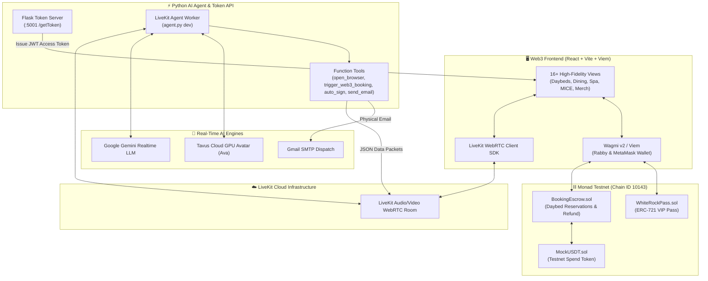

# 🌊 White Rock Beach Club Bali — Archava Web3 AI Concierge

[-8A2BE2?style=for-the-badge&logo=ethereum)](https://testnet.monadexplorer.com)
[](https://livekit.io)
[](https://tavus.io)
[](https://soliditylang.org)
[](https://vitejs.dev)

> **The World's First Web3 Luxury Beach Club Experience** — Powered by **Monad Testnet Smart Contracts**, **LiveKit Real-Time WebRTC Voice Infrastructure**, and **"Ava" Tavus AI Video Avatar Concierge**.

---

## 📸 Executive Summary

**Archava (White Rock Beach Club)** elevates luxury hospitality on Melasti Beach, Bali by pairing high-fidelity Web3 smart contract infrastructure with a 24/7 autonomous AI Video Avatar Concierge named **Ava**.

Guests can seamlessly converse via real-time WebRTC voice, inquire about venue amenities, inspect daybeds, trigger instant **1-Click Web3 Reservations** paid in crypto/USDT via **Rabby/MetaMask Wallet**, receive instant physical email confirmations, and mint tiered **VIP NFT Pass Subscriptions** on the ultra-fast Monad Testnet.

---

## 🏛️ System Architecture



---

## 🔥 Key Features

### 1. 🤖 Ava — Web3 Voice AI Concierge
* **Real-Time WebRTC Audio & Video Streaming**: Zero-latency voice dialogue powered by Google Gemini LLM & Tavus cloud avatar GPUs.
* **Autonomous UI Navigation (`open_browser`)**: Ava programmatically navigates the guest's screen to target sections (`/daybeds-suites`, `/dining`, `/spa-wellness`, `/booking`, `/valet-parking`) and clicks header navbar buttons automatically.
* **Voice-Triggered Wallet Authorization (`sign_web3_transaction`)**: Guests can say *"Sign transaction"*, *"Konfirmasi"*, or *"Setujui"*, and Ava instantly triggers a Web3 wallet confirmation modal.
* **Speech-to-Text Email Normalizer**: Automatically corrects domain hallucinations (e.g. `@gamil.com`, `@gmail.co` $\rightarrow$ `@gmail.com`) before physical SMTP dispatch.
* **Silenced Disconnect & Grace Delay**: 8.0s server grace delay ensures Ava completes her closing statements naturally without clipping.

### 2. ⛓️ On-Chain Daybed Reservations (`BookingEscrow.sol`)
* **1-Click Web3 Booking Modal**: Triggered via voice or UI for 4 daybed tiers:
  * **Lagoon Bed** (0.01 MON / USDT)
  * **VIP Cabana** (0.025 MON / USDT)
  * **Party Suite** (0.05 MON / USDT)
  * **Single Sofa** (0.005 MON / USDT)
* **24-Hour Refund Escrow Policy**: On-chain cancellation and 100% deposit refund up to 24 hours prior to visit date.
* **Staff QR Code Check-In Terminal**: Venue staff scan guest QR codes to execute `claimDeposit()` on-chain.

### 3. 🎫 Tiered NFT VIP Pass (`WhiteRockPass.sol`)
* **ERC-721 Membership NFT**: Mintable on Monad Testnet granting tiered perks:
  * **Gold Pass**: 10% spend discount.
  * **Platinum Pass**: 15% spend discount + priority lagoon access.
  * **Diamond Pass**: 20% spend discount + private butler service.

### 4. 🌐 Internationalization & Dynamic Currency Engine
* **4 Languages**: Full support for English (EN), Indonesian (ID), Russian (RU), and Korean (KO).
* **Auto-Currency Conversion**: Real-time pricing toggle for **USD ($)**, **IDR (Rp)**, **RUB (₽)**, and **KRW (₩)**.

### 5. 💎 16 High-Fidelity Luxury Views
* Pages for Daybeds, Dining (Le Jardin & Sky Lounge), Experiences, Spa & Wellness, Fitness Center, Weddings & MICE, Live Weather, Merch, NYE Events, Valet Parking, and Interactive Staff Scanner.

---

## 📜 Deployed Smart Contracts (Monad Testnet)

* **Chain ID**: `10143`
* **RPC URL**: `https://testnet-rpc.monad.xyz/`
* **Currency**: `MON`

| Contract Name | Type | Monad Testnet Address | Explorer Link |
|---|---|---|---|
| **WhiteRockPass** | ERC-721 VIP NFT | `0x5Bb5A242A2Db2a40592407676FcfcEe94ce7342E` | [View on Explorer](https://testnet.monadexplorer.com/address/0x5Bb5A242A2Db2a40592407676FcfcEe94ce7342E) |
| **BookingEscrow** | Escrow Booking | `0x7FB626bcF2722f45e25EEd445385e2Da34B1077e` | [View on Explorer](https://testnet.monadexplorer.com/address/0x7FB626bcF2722f45e25EEd445385e2Da34B1077e) |
| **MockUSDT** | ERC-20 Test Token | `0x53f42a3edfca4927f9754b92b458323c77d6a4fd` | [View on Explorer](https://testnet.monadexplorer.com/address/0x53f42a3edfca4927f9754b92b458323c77d6a4fd) |

---

## 🛠️ Tech Stack & Dependencies

| Category | Technology |
|---|---|
| **Frontend Framework** | React 18, Vite 5, TypeScript |
| **Styling & UI** | Tailwind CSS, Shadcn UI, Lucide Icons, Framer Motion |
| **Web3 & Wallet** | Viem, Wagmi v2, RainbowKit, Monad Testnet |
| **AI Voice & Avatar** | LiveKit Agents Python SDK, Google Gemini LLM, Tavus WebRTC Avatar |
| **Backend API** | Python 3.13, Flask, Flask-CORS, SMTP SSL |
| **Smart Contracts** | Solidity 0.8.20, Foundry, OpenZeppelin v5, Certora Verification |

---

## ⚙️ Prerequisites & Environment Setup

### System Requirements
* **Node.js**: `>= 18.0.0` (or `bun`)
* **Python**: `3.10` – `3.13`
* **Web3 Wallet**: Rabby Wallet or MetaMask configured to **Monad Testnet**

### Environment Variables (`.env`)

#### 1. Backend Environment (`backend/.env`)
Create `backend/.env` with the following variables:

```ini
LIVEKIT_URL=wss://receptionist-lwypqvqa.livekit.cloud
LIVEKIT_API_KEY=your_livekit_api_key
LIVEKIT_API_SECRET=your_livekit_api_secret

GEMINI_API_KEY=your_gemini_api_key
GEMINI_MODEL=gemini-3.1-flash-live-preview
GEMINI_VOICE=Kore

# Optional. Ava automatically continues in voice-only mode when Tavus is
# unconfigured or unavailable.
TAVUS_API_KEY=your_tavus_api_key
FACE_ID=your_tavus_face_id
PAL_ID=
TAVUS_ENABLED=true

# Optional MCP integration. Leave blank to disable.
N8N_MCP_SERVER_URL=

GMAIL_SENDER_EMAIL=your_email@gmail.com
GMAIL_APP_PASSWORD=your_gmail_app_password
```

#### 2. Frontend Environment (`.env` in root)
Create `.env` in the root directory:

```ini
VITE_LIVEKIT_URL=wss://receptionist-lwypqvqa.livekit.cloud
```

---

## 🚀 Step-by-Step Installation & Running Guide

### Step 1: Install Frontend Dependencies
```bash
# From the root directory
npm install
```

### Step 2: Set Up Python Virtual Environment
```bash
# Create virtual environment in root
python3 -m venv .venv

# Activate virtual environment
source .venv/bin/activate

# Install Python requirements
pip install -r backend/requirements.txt
```

---

## 💻 Running the Application (3 Microservices)

To run the complete ecosystem locally, launch the following **3 services** in separate terminal tabs:

### Service 1: Flask Token Server API (Port 5001)
Generates secure LiveKit WebRTC room tokens for joining participants.
```bash
cd backend
../.venv/bin/python server.py
```
> ℹ️ *Note: Server runs on `http://localhost:5001`. Do not open this URL directly in a browser without `/getToken` query params.*

### Service 2: LiveKit AI Agent Worker ("Ava")
Connects to LiveKit Cloud and handles real-time audio dialogue, Gemini LLM reasoning, and tool execution.
```bash
cd backend
../.venv/bin/python agent.py dev
```

### Service 3: React Frontend Web Application (Port 5173)
Starts the Vite development server.
```bash
# From the root directory
npm run dev -- --host
```

👉 **Access the App**: Open your browser and navigate to **`http://localhost:5173/`**.

---

## ⚡ Quick Start (One Command)

After the one-time dependency setup above, launch all three services with:

```bash
npm run dev:all
```

Press `Ctrl+C` once to stop the frontend, token API, and Ava worker together.
If Tavus has no conversational credits, the UI automatically switches to
Gemini voice-only mode instead of remaining stuck on the video loading screen.
Set `TAVUS_ENABLED=false` to skip Tavus entirely; change it back to `true` after
restoring conversational credits.

---

## 🧪 Smart Contract Testing & Verification

Smart contracts are located in the `contracts/` directory built using **Foundry**.

```bash
cd contracts

# Compile smart contracts
forge build

# Run unit tests
forge test -vvv

# Run formal verification (Certora)
certoraRun certora/conf/BookingEscrow.conf
```

---

## 🌐 Production Deployment (Vercel)

### Deploy Frontend to Vercel
1. Push repo to GitHub (`Archverse0-0/Archava`).
2. Import project into Vercel Dashboard.
3. Configure settings:
   * **Framework Preset**: `Vite`
   * **Root Directory**: `/`
   * **Build Command**: `npm run build`
   * **Output Directory**: `dist`
4. Add Environment Variable:
   * `VITE_LIVEKIT_URL` = `wss://receptionist-lwypqvqa.livekit.cloud`
5. Click **Deploy**.

---

## ❓ Troubleshooting & FAQs

#### 1. Why do I see `404 Not Found` when opening `http://localhost:5001`?
Port `5001` is the **Flask Token Backend API**, which only exposes the `/getToken` endpoint for LiveKit room creation. To view the website interface, open **`http://localhost:5173/`**.

#### 2. AI Voice Avatar ("Ava") fails to connect?
* Verify that `VITE_LIVEKIT_URL` is correctly set in your root `.env`.
* Ensure both `server.py` (Port 5001) and `agent.py dev` are active and connected to LiveKit Cloud.

#### 3. How do I record the AI Avatar interaction with audio?
Use `wf-recorder` with PipeWire loopback sink:
```bash
wpctl set-volume 61 1.30 && wf-recorder --audio=mix_sink.monitor -f ~/avatar_demo.mp4
```

---

## 📄 License

This project is proprietary software developed for **White Rock Beach Club Bali** / **Archava**. All rights reserved.

---

<p center="align">
  <b>Developed with ❤️ for White Rock Beach Club, Melasti Beach, Ungasan, Uluwatu, Bali</b>
</p>
